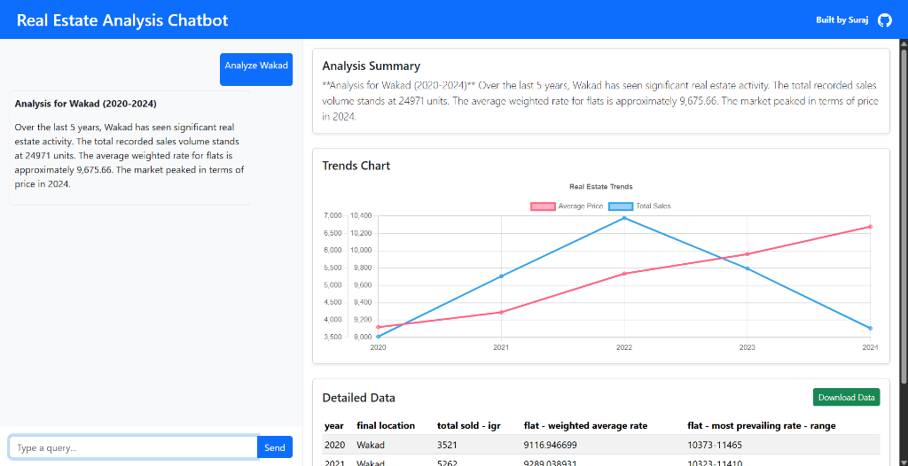

# Real Estate Analysis Chatbot



A web-based chatbot that analyzes real estate data, built with React and Django.

[**🔴 Live Demo**](https://real-estate-chatbot1.vercel.app/)

## Features
- **Chat Interface**: Natural language queries like "Analyze Wakad".
- **Visualizations**: Interactive charts for Price and Demand trends.
- **Data Table**: Filtered raw data display.
- **Download Data**: Export filtered data to CSV.
- **AI Analytics**: Generates summaries using OpenAI (optional) or mock logic.

## Setup

### Prerequisites
- Node.js & npm
- Python 3.8+

### Backend Setup
1. Navigate to the backend directory:
   ```bash
   cd backend
   ```
2. Create and activate virtual environment:
   ```bash
   python -m venv venv
   .\venv\Scripts\Activate
   ```
3. Install dependencies:
   ```bash
   pip install -r requirements.txt
   ```
4. (Optional) Set OpenAI API Key:
   - Create a `.env` file or export the variable:
     ```bash
     $env:OPENAI_API_KEY="your-api-key-here"
     ```
   - *Note: If no key is provided, the system falls back to a mock summary generator.*
5. Run the server:
   ```bash
   python manage.py runserver
   ```
   Backend runs at http://localhost:8000.

### Frontend Setup
1. Navigate to the frontend directory:
   ```bash
   cd frontend
   ```
2. Install dependencies:
   ```bash
   npm install
   ```
3. Run the development server:
   ```bash
   npm run dev
   ```
   Frontend runs at http://localhost:5173.

## Usage
1. Open the frontend URL.
2. Type a query: "Analyze Wakad", "Show me details for Aundh".
3. View the summary, chart, and table.
4. Click "Download Data" to save the results.
